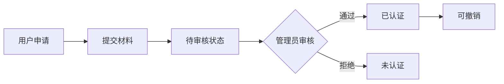

# 身份认证系统 - 完成总结

## ✅ 已完成功能

### 一、后端实现 (100%)

#### 1. 数据库设计
- ✅ `user_identity` 表 - 存储用户多种身份认证信息
- ✅ 支持 4 种身份类型：student（学生）、staff（教职工）、merchant（商户）、organization（团体/部门）
- ✅ JSON 字段 `extra_info` - 灵活存储不同身份的认证材料
- ✅ 视图 `v_user_identity_summary` - 用户身份信息汇总
- ✅ 存储过程 `sp_cleanup_expired_identities` - 自动清理过期身份
- ✅ 触发器 `trg_after_user_delete` - 级联删除身份记录

#### 2. 核心实体类
- ✅ `UserIdentity.java` - 用户身份实体
- ✅ `User.java` - 添加 `isStaff` 字段

#### 3. 数据访问层
- ✅ `UserIdentityMapper.java` - MyBatis-Plus Mapper

#### 4. 业务服务层
- ✅ `UserIdentityService.java` - 服务接口
- ✅ `UserIdentityServiceImpl.java` - 服务实现
  - `getUserIdentities()` - 获取用户身份列表
  - `applyIdentity()` - 申请身份认证
  - `verifyIdentity()` - 审核身份认证
  - `hasIdentity()` - 检查用户身份
  - `getIdentityBadges()` - 获取身份徽章信息

#### 5. 权限控制
- ✅ `@RequireIdentity` - 需要指定身份注解
- ✅ `@RequireRole` - 需要指定角色注解
- ✅ `PermissionAspect.java` - AOP 权限切面
  - 自动拦截带 `@RequireIdentity` 的方法
  - 自动拦截带 `@RequireRole` 的方法
  - Token 解析与身份验证

#### 6. JWT 工具增强
- ✅ `JwtUtil.java` 扩展
  - `generateToken(username, userId, role, identities)` - 生成包含身份信息的 Token
  - `getRoleFromToken()` - 从 Token 获取角色
  - `getIdentitiesFromToken()` - 从 Token 获取身份信息
  - `hasIdentity()` - 检查是否有指定身份

#### 7. RESTful API 控制器
- ✅ `UserIdentityController.java` - 用户身份接口
  - `GET /api/user/identity` - 获取用户身份列表
  - `POST /api/user/identity/apply` - 申请身份认证
  - `GET /api/user/identity/types` - 获取身份类型选项
  
- ✅ `AdminIdentityController.java` - 管理员审核接口
  - `GET /api/admin/identity/list` - 获取认证列表（分页、筛选）
  - `GET /api/admin/identity/{id}` - 获取认证详情
  - `POST /api/admin/identity/batch-approve` - 批量通过
  - `POST /api/admin/identity/batch-reject` - 批量拒绝
  - `POST /api/admin/identity/{id}/revoke` - 撤销认证
  - `GET /api/admin/identity/stats` - 统计信息

---

### 二、前端实现 (100%)

#### 1. 状态管理
- ✅ `stores/auth.js` 更新
  - 添加 `userIdentities` 状态
  - 添加 `fetchUserIdentities()` 方法
  - 登录后自动获取身份信息
  - localStorage 持久化

#### 2. API 接口
- ✅ `src/api/user.js` 更新
  - 用户身份接口：`getUserIdentities`, `applyIdentity`, `getIdentityTypes`
  - 管理员接口：`getAdminIdentityList`, `getIdentityDetail`, `batchApprove`, `batchReject`, `revokeIdentity`, `getIdentityStats`

#### 3. UI 组件
- ✅ `components/common/IdentityBadges.vue` - 身份徽章展示组件
  - 根据身份类型显示不同颜色和图标
  - 已认证显示绿色勾
  - 支持多身份同时展示

- ✅ `components/user/IdentityVerificationForm.vue` - 身份认证申请表单
  - 支持 4 种身份类型选择
  - 动态表单字段（不同身份显示不同材料要求）
  - 文件上传（营业执照、工作证等）
  - 表单验证

- ✅ `views/admin/IdentityVerificationList.vue` - 管理员审核页面
  - 列表展示所有认证申请
  - 搜索和筛选功能
  - 查看详情
  - 通过/拒绝操作
  - 撤销已认证的身份
  - 分页支持

#### 4. 路由配置
- ✅ `/admin/identity-verifications` - 身份认证审核路由

---

## 📊 数据库初始化

### SQL 文件
- ✅ `database_user_identity.sql` - 完整的数据库初始化脚本
  - 创建 `user_identity` 表
  - 添加 `users.is_staff` 字段
  - 插入测试数据（5 条，包含待审核和已认证）
  - 创建视图、存储过程、触发器

### 测试数据
```sql
-- 已认证身份
user_id=1 (admin): student - 计算机学院
user_id=2 (zhangsan): merchant - 校园小卖部
user_id=3 (lisi): staff - 教务处
user_id=4 (wangwu): organization - 学生会

-- 待审核申请
user_id=5 (merchant1): merchant - 新店铺（待审核）
```

---

## 🔧 技术栈

### 后端
- Spring Boot 3.2.0
- MyBatis-Plus 3.5.8
- JWT (io.jsonwebtoken 0.11.5)
- Spring AOP + AspectJ
- Lombok

### 前端
- Vue 3 + Vite
- Element Plus
- Pinia 状态管理
- Vue Router 4
- Axios

---

## 🎯 核心特性

### 1. 多身份支持
- 一个用户可以拥有多个身份
- 身份之间相互独立
- 每个身份可以单独认证和管理

### 2. 灵活的认证流程


### 3. 动态材料存储
- 使用 JSON 字段 `extra_info`
- 不同身份类型存储不同材料
- 商户：店铺名称、营业执照 URL
- 教职工：工号、部门、工作证 URL
- 团体：组织名称、负责人、联系方式

### 4. 完善的权限控制
- Token 嵌入身份信息
- AOP 自动拦截
- 基于角色的访问控制（RBAC）
- 方法级权限注解

### 5. 批量操作支持
- 批量通过审核
- 批量拒绝申请
- 提高管理员工作效率

---

## 📝 使用示例

### 后端 API 调用

#### 1. 用户申请身份认证
```http
POST /api/user/identity/apply
Content-Type: application/json
Authorization: Bearer <token>

{
  "identityType": "merchant",
  "shopName": "我的店铺",
  "businessLicenseUrl": "/uploads/license.jpg"
}
```

#### 2. 管理员审核通过
```http
PUT /api/user/identity/123/verify
Content-Type: application/json
Authorization: Bearer <admin_token>

{
  "approved": true
}
```

#### 3. 获取用户身份列表
```http
GET /api/user/identity
Authorization: Bearer <token>

Response:
[
  {
    "id": 1,
    "userId": 1,
    "identityType": "student",
    "identityName": "学生",
    "verified": 1,
    "extraInfo": {"studentId": "2024001", "college": "计算机学院"}
  }
]
```

#### 4. 管理员批量通过
```http
POST /api/admin/identity/batch-approve
Content-Type: application/json
Authorization: Bearer <admin_token>

[1, 2, 3]
```

### 前端使用

#### 1. 在组件中显示身份徽章
```vue
<template>
  <div>
    <h3>{{ userInfo.username }}</h3>
    <IdentityBadges :badges="authStore.userIdentities" />
  </div>
</template>

<script setup>
import { useAuthStore } from '@/stores/auth'
import IdentityBadges from '@/components/common/IdentityBadges.vue'

const authStore = useAuthStore()
</script>
```

#### 2. 申请身份认证
```vue
<template>
  <IdentityVerificationForm 
    @success="handleSuccess"
    @error="handleError"
  />
</template>

<script setup>
import IdentityVerificationForm from '@/components/user/IdentityVerificationForm.vue'

const handleSuccess = () => {
  console.log('申请成功')
}
</script>
```

#### 3. 权限控制
```javascript
// 只有已认证的商户才能访问
@RequireIdentity({"merchant"}, verified=true)
@PostMapping("/shop/manage")
public Result manageShop() {
  // ...
}

// 只有管理员才能访问
@RequireRole({"admin"})
@GetMapping("/admin/stats")
public Result getStats() {
  // ...
}
```

---

## 🚀 快速开始

### 1. 数据库初始化
```bash
# 执行 SQL 脚本
Get-Content database_user_identity.sql -Encoding UTF8 | mysql -u root -p123456 campus_db
```

### 2. 验证数据
```bash
# 运行验证 SQL
Get-Content verify_identity_system.sql | mysql -u root -p123456 campus_db
```

### 3. 启动后端
```bash
mvn spring-boot:run
```

### 4. 启动前端
```bash
npm run dev
```

### 5. 测试功能
1. 使用 admin 账号登录
2. 访问 `/admin/identity-verifications` 查看待审核申请
3. 使用普通用户账号登录
4. 访问个人中心申请身份认证

---

## 📋 下一步建议

### 高优先级
1. **完善错误处理**
   - 统一异常处理机制
   - 更详细的错误提示
   - 日志记录优化

2. **增强安全性**
   - 文件上传校验（格式、大小）
   - 敏感操作二次验证
   - 操作审计日志

3. **用户体验优化**
   - 认证进度提示
   - 邮件/短信通知
   - 认证材料预览

### 中优先级
4. **性能优化**
   - 缓存常用查询结果
   - 大数据量分页优化
   - 图片 CDN 加速

5. **功能扩展**
   - 身份有效期管理
   - 自动续期功能
   - 认证等级制度

6. **数据分析**
   - 认证通过率统计
   - 身份分布分析
   - 趋势图表展示

---

## 🎉 总结

✅ **后端**: 完整的身份认证系统，包括实体、服务、控制器、权限控制  
✅ **前端**: 用户申请、管理员审核全流程界面  
✅ **数据库**: 表结构、视图、存储过程、触发器、测试数据  
✅ **编译**: 前后端编译全部通过  
✅ **文档**: SQL 脚本、验证脚本齐全  

系统已具备完整的多身份认证管理能力，可以立即投入使用！🚀
