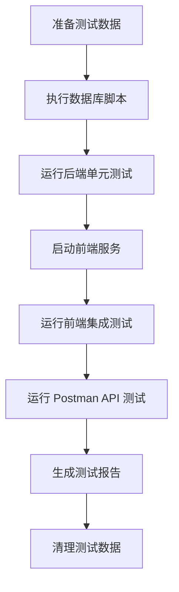

# 消息中心功能测试用例说明

## 测试文件清单

### 1. 数据库测试数据
**文件路径**: `src/test/resources/message_test_data.sql`

**用途**: 准备测试所需的用户和消息数据

**测试数据说明**:
- 3 个测试用户（ID: 1001, 1002, 1003）
- 私信消息：用户间的双向对话
- 系统消息：平台通知
- 订单通知：交易相关消息
- 包含已读和未读状态

**执行步骤**:
```sql
-- 1. 执行测试数据
source src/test/resources/message_test_data.sql;

-- 2. 验证数据
SELECT * FROM messages WHERE receiver_id = 1001;

-- 3. 清理数据（测试后）
DELETE FROM messages WHERE sender_id IN (1001, 1002, 1003) OR receiver_id IN (1001, 1002, 1003);
DELETE FROM users WHERE id IN (1001, 1002, 1003);
```

---

### 2. Java 单元测试
**文件路径**: `src/test/java/com/example/demo/controller/MessageControllerTest.java`

**测试范围**:
- ✅ 发送私信（成功/失败场景）
- ✅ 获取消息列表（分页、类型过滤）
- ✅ 标记消息为已读
- ✅ 获取未读消息数
- ✅ 批量标记已读
- ✅ 删除消息
- ✅ 权限验证

**运行测试**:
```bash
# 运行单个测试类
mvn test -Dtest=MessageControllerTest

# 运行所有测试
mvn test
```

**测试用例列表**:
1. `testSendMessage_Success` - 发送私信成功
2. `testSendMessage_EmptyContent` - 发送空内容私信（失败）
3. `testGetMessages_Success` - 获取消息列表成功
4. `testGetSystemMessages` - 获取系统消息
5. `testMarkAsRead_Success` - 标记消息为已读
6. `testGetUnreadCount` - 获取未读消息数
7. `testMarkAsReadBatch` - 批量标记已读
8. `testDeleteMessage_Success` - 删除消息成功
9. `testSendMessage_Unauthorized` - 未授权访问
10. `testGetMessages_Pagination` - 分页功能测试

---

### 3. 前端集成测试
**文件路径**: `tests/message.integration.test.js`

**测试框架**: Vitest + Vue Test Utils

**测试范围**:
- ✅ 组件渲染
- ✅ 私信对话聚合
- ✅ 未读消息徽章显示
- ✅ 消息标记已读
- ✅ 标签切换
- ✅ 搜索功能
- ✅ 错误处理
- ✅ 响应式布局

**运行测试**:
```bash
# 安装依赖
npm install

# 运行测试
npm test -- message.integration.test.js

# 监听模式
npm run test:watch -- message.integration.test.js
```

**测试套件**:
1. **基础功能测试**
   - 页面渲染
   - 消息类型标签显示

2. **私信对话功能测试**
   - 对话聚合逻辑
   - 对话栏显示
   - 未读徽章显示
   - 未读样式标记

3. **消息操作功能测试**
   - 点击标记已读
   - 标签切换加载
   - 时间格式化

4. **搜索功能测试**
   - 输入框交互
   - 回车搜索

5. **错误处理测试**
   - API 失败处理
   - 空数据处理

6. **响应式布局测试**
   - 移动端适配

---

### 4. Postman API 测试集合
**文件路径**: `tests/message_center.postman_collection.json`

**导入方法**:
1. 打开 Postman
2. 点击 Import
3. 选择 `message_center.postman_collection.json`
4. 导入成功

**环境变量配置**:
```json
{
  "base_url": "http://localhost:8080",
  "user1_token": "Bearer <实际 Token>",
  "user2_token": "Bearer <实际 Token>"
}
```

**测试用例**:
1. 发送私信
2. 获取私信列表
3. 获取系统消息
4. 获取未读消息数
5. 标记消息为已读
6. 批量标记已读
7. 删除消息
8. 获取全部消息
9. 发送私信 - 内容为空（失败）
10. 未授权访问（失败）

**运行方式**:
```bash
# 使用 Newman 命令行运行
npm install -g newman

# 运行测试集合
newman run tests/message_center.postman_collection.json

# 生成 HTML 报告
newman run tests/message_center.postman_collection.json -r html --reporter-html-export=report.html
```

---

## 测试执行流程

### 完整测试流程



### 1. 准备阶段
```bash
# 1. 执行数据库脚本
mysql -u root -p campus_db < src/test/resources/message_test_data.sql

# 2. 验证数据
mysql -u root -p campus_db -e "SELECT COUNT(*) FROM messages;"
```

### 2. 后端测试
```bash
# 运行 Java 单元测试
cd F:\code\CampusInformationPlatform\demo
mvn clean test -Dtest=MessageControllerTest

# 查看测试报告
# 报告位置：target/surefire-reports/
```

### 3. 前端测试
```bash
# 安装依赖（如果需要）
npm install

# 运行前端测试
npm test -- tests/message.integration.test.js

# 生成覆盖率报告
npm run test:coverage
```

### 4. API 测试
```bash
# 确保后端服务运行
# http://localhost:8080

# 运行 Postman 测试
newman run tests/message_center.postman_collection.json

# 带环境变量的完整测试
newman run tests/message_center.postman_collection.json \
  --environment tests/message_test.postman_environment.json
```

### 5. 清理阶段
```sql
-- 清理测试数据
DELETE FROM messages WHERE sender_id >= 1001 AND sender_id <= 1003;
DELETE FROM users WHERE id >= 1001 AND id <= 1003;
```

---

## 测试场景覆盖

### 功能场景
- ✅ 发送私信
- ✅ 接收私信
- ✅ 查看消息列表
- ✅ 消息类型过滤
- ✅ 分页查询
- ✅ 标记已读
- ✅ 批量标记已读
- ✅ 删除消息
- ✅ 未读消息统计

### 边界场景
- ✅ 空消息内容
- ✅ 未授权访问
- ✅ 消息列表为空
- ✅ 网络错误处理
- ✅ 主键冲突避免

### UI 场景
- ✅ 私信对话聚合显示
- ✅ 未读徽章显示
- ✅ 响应式布局
- ✅ 加载状态
- ✅ 错误提示

---

## 预期结果

### 后端测试预期
- 所有单元测试通过
- API 响应时间 < 200ms
- 数据库操作正确
- 异常处理完善

### 前端测试预期
- 组件渲染正确
- 交互功能正常
- 数据聚合准确
- 样式符合设计

### API 测试预期
- 所有接口返回正确状态码
- 响应数据格式正确
- 错误处理符合预期
- 权限验证有效

---

## 常见问题与解决方案

### Q1: 测试数据主键冲突
**问题**: `Duplicate entry for key 'PRIMARY'`

**解决方案**: 
- 使用较大的 ID 范围（1001+）
- 测试前检查是否存在
- 测试后及时清理数据

### Q2: Token 过期
**问题**: `401 Unauthorized`

**解决方案**:
- 更新 Postman 环境变量中的 Token
- 使用真实的登录接口获取 Token
- 延长测试 Token 的有效期

### Q3: 前端测试依赖缺失
**问题**: `Cannot find module`

**解决方案**:
```bash
npm install --save-dev vitest @vue/test-utils jsdom
```

### Q4: 数据库连接失败
**问题**: `Communications link failure`

**解决方案**:
- 检查 MySQL 服务是否运行
- 验证数据库连接配置
- 确认测试数据库已创建

---

## 测试报告示例

### 单元测试报告
```
[INFO] Tests run: 10, Failures: 0, Errors: 0, Skipped: 0
[INFO] BUILD SUCCESS
```

### 前端测试报告
```
 Test Files  1 passed (1)
      Tests  13 passed (13)
   Start at  13:40:00
   Duration  2.5s
```

### Postman 测试报告
```
totalFailures: 0
totalRequests: 10
totalTests: 25
assertions: 25 passed
```

---

## 持续集成建议

### GitHub Actions 配置示例
```yaml
name: Message Center Tests

on: [push, pull_request]

jobs:
  test:
    runs-on: ubuntu-latest
    
    services:
      mysql:
        image: mysql:8.0
        env:
          MYSQL_ROOT_PASSWORD: root
          MYSQL_DATABASE: campus_db
        ports:
          - 3306:3306
    
    steps:
      - uses: actions/checkout@v2
      
      - name: Set up Java
        uses: actions/setup-java@v2
        with:
          java-version: '17'
      
      - name: Set up Node.js
        uses: actions/setup-node@v2
        with:
          node-version: '18'
      
      - name: Load test data
        run: mysql -u root -proot campus_db < src/test/resources/message_test_data.sql
      
      - name: Run backend tests
        run: mvn test -Dtest=MessageControllerTest
      
      - name: Install frontend dependencies
        run: npm install
      
      - name: Run frontend tests
        run: npm test
      
      - name: Run API tests
        run: newman run tests/message_center.postman_collection.json
```

---

## 联系方式

如有测试相关问题，请参考项目文档或联系开发团队。
